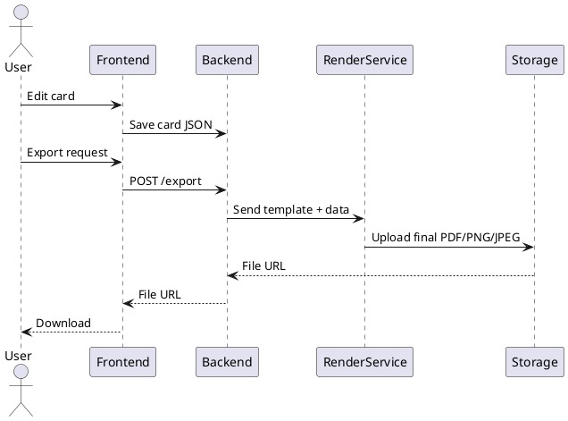

# SPEC-1-Baseball Card Creator

## Background

You want to build a web application for **hobbyists** that allows people to design, customize, and export baseball trading cards. Key capabilities include:

- Users can **create custom templates** (layout, fonts, colors, card dimensions, front/back designs).
- The site ships with **default templates**, including high-fidelity replicas inspired by vintage early-1990s baseball card brands (for hobbyist/nostalgic use).
- Users can input player information and statistics, upload or import player images, and position/resize assets within the template.
- Output formats: **print-ready PDF**, **PNG**, and **JPEG** (high resolution suitable for printing and social sharing).
- Focus is hobbyist-friendly (easy-to-use design tools, drag-and-drop editor) while supporting high-quality exports for printing.


(If this Background looks good, I will move to the Requirements section next.)


## Requirements

### Must Have
- Users can create and edit custom card templates
- Users can choose from default 1990s-inspired vintage templates
- Drag-and-drop card editor (text, images, stats)
- High-resolution export to PDF, PNG, JPEG
- User account system to save templates and cards
- Template engine to render front + back card designs

### Should Have
- Image cropping and background removal
- Support for custom fonts (uploaded or provided in-app)
- Mobile-friendly editing interface

### Could Have
- Social sharing (public galleries, links)
- Community marketplace for template sharing

### Won’t Have (MVP)
- Real-time collaboration
- AI-generated player photos or designs


## Method

### High-Level Architecture
- **Frontend**: React (Next.js) app providing drag-and-drop card editor using Fabric.js or Konva.js for canvas-based editing.
- **Backend**: Node.js (NestJS) for template management, user accounts, and export operations.
- **Rendering Service**: Dedicated microservice using **Headless Chromium** or **Resvg** to render templates into PDF/PNG/JPEG.
- **Storage**: AWS S3 (or similar) for templates, user images, and exported cards.
- **Database**: PostgreSQL for user accounts, template metadata, and saved card configurations.

### Template Model
```
Table: templates
- id (uuid)
- user_id (nullable for default templates)
- name
- description
- front_json (layout schema)
- back_json (layout schema)
- is_default (boolean)
- created_at
- updated_at
```

### Card Instance Model
```
Table: cards
- id (uuid)
- user_id
- template_id
- card_data_json (player stats, text fields, image references)
- created_at
- updated_at
```

### Rendering Flow (PlantUML)


### Editor Component Architecture
- **Canvas Layer**: Uses Fabric.js/Konva to place text, stats, and images.
- **Asset Manager**: Handles image uploads, cropping, and background removal (using remove.bg API or custom TensorFlow.js model in later phase).
- **Template Engine**: Translates JSON layout + user content into deterministic rendering instructions for the renderer.

### Default Vintage Templates
- Recreate early 90s brands (e.g., Topps, Donruss, Score) with legally distinct but visually inspired designs.
- Each template stored as JSON defining:
  - Font families
  - Layout positions (absolute coords)
  - Color palettes
  - Background textures

(If this looks good, I will proceed to **Implementation** next.)

## Implementation

### 1. Project Setup
- Initialize **Next.js** frontend project
- Initialize **NestJS** backend API
- Create separate **Rendering Service** (Node.js with Puppeteer/Resvg)
- Configure PostgreSQL + Prisma ORM
- Set up AWS S3 buckets (images, templates, exports)

### 2. User Authentication
- Implement email/password auth using **NextAuth** or custom JWT flow
- Create middleware for protected routes

### 3. Template Editor
- Integrate **Fabric.js** or **Konva.js** on a React canvas
- Implement draggable/resizable work area components
- Add controls for:
  - Text blocks (font, size, color)
  - Image blocks (upload, crop, reposition)
  - Stat fields
- Implement JSON export/import of template layout

### 4. Default Template Seeder
- Create JSON definitions for 3–5 vintage-style templates
- Write backend seed script to insert them into DB

### 5. Card Builder
- Map user data fields to template JSON
- Allow swapping templates while keeping user content
- Store card instances in DB

### 6. Rendering Pipeline
- Backend receives `/export` request
- Validates user + template
- Sends merged JSON → Rendering Service
- Rendering Service loads JSON into headless canvas environment and outputs:
  - **PNG 300 DPI**
  - **JPEG 300 DPI**
  - **PDF (vector where possible)**
- Upload result to S3 and return signed URL

### 7. UI/UX Polish
- Add mobile adjustments
- Add undo/redo history to editor
- Add template preview cards

### 8. Deployment
- Deploy via **Vercel (frontend)** and **AWS ECS (backend & renderer)**
- Use AWS RDS for PostgreSQL
- Use CloudFront over S3 for fast delivery


## Milestones

### Milestone 1 — Core Setup (1–2 weeks)
- Frontend + Backend project initialized
- Database configured (PostgreSQL + Prisma)
- Auth working with basic user accounts
- S3 buckets created

### Milestone 2 — Template Editor MVP (2–3 weeks)
- Canvas editor with text + image placement
- Template JSON model implemented
- Save/load custom templates

### Milestone 3 — Default Vintage Templates (1 week)
- 3–5 vintage 90s-inspired templates created
- Seeder script implemented

### Milestone 4 — Card Builder (2 weeks)
- User card data input form
- Card-instance JSON generation
- Preview mode

### Milestone 5 — Rendering Service (2–3 weeks)
- Export pipeline functional (PDF, PNG, JPEG)
- File uploads to S3
- Download links returned

### Milestone 6 — UI Polish + Mobile (1–2 weeks)
- Undo/redo
- Improved UI components
- Mobile support

### Milestone 7 — Deployment (1 week)
- Frontend on Vercel
- Backend + Renderer on AWS ECS
- Final QA & UAT


## Gathering Results

### Evaluation Metrics
- **Export Quality**: Validate that PDF/PNG/JPEG exports meet 300 DPI print standards and match on-screen layout.
- **Template Fidelity**: Confirm vintage templates closely resemble early 90s designs (but remain legally distinct).
- **Performance**: Rendering service exports a card in under 3 seconds on average.
- **Editor Usability**: Conduct user testing to ensure hobbyists can create a card without instruction.
- **Stability**: No loss of user template or card data across sessions.

### Post-Launch Monitoring
- Track errors in rendering pipeline.
- Monitor database query performance and optimize slow queries.
- Log frontend UI failures and canvas-editor exceptions.
- Gather user feedback via optional survey modal.

### Success Criteria
- Users can create a card from scratch in < 5 minutes.
- 95% successful export rate with no layout distortions.
- At least 3 default templates actively used by users.
- Positive feedback from hobbyists on ease of use and card quality.

